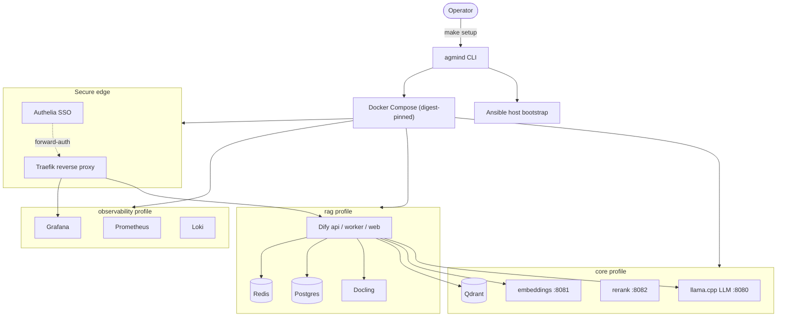

# AGmind64

**Собственный приватный AI-стек — LLM, RAG, observability и SSO — на одной машине, одной командой.**

> 🔗 Другое железо? Это сборка под AMD Strix Halo / x86_64 — смотри родственный проект [**AGmind**](https://github.com/botAGI/AGmind).

[English](README.md) | Русская версия

[](https://github.com/botAGI/AGmind64/actions/workflows/ci.yml)
[](LICENSE)
[](pyproject.toml)

AGmind превращает хост на AMD Ryzen AI Max+ «Strix Halo» (Radeon 8060S / gfx1151) —
или любую x86_64 Linux-машину — в полностью самостоятельную AI-платформу. Никакого
облака, никаких API-ключей за пределами вашей сети: локальная LLM с
OpenAI-совместимым API, embeddings и reranking, RAG-приложение, векторное
хранилище, edge-авторизация и набор мониторинга — всё связано и развёрнуто одной
командой `make setup`.

## Что вы получаете

- **Локальный inference** — llama.cpp отдаёт LLM, embeddings и reranking на
  Vulkan/ROCm (с CPU-fallback) через OpenAI-совместимые HTTP-эндпоинты.
- **RAG из коробки** — приложение Dify, векторное хранилище Qdrant, парсинг
  документов (Docling); опциональная линия RAGFlow.
- **Observability** — Prometheus, Grafana, Loki, Alloy, cAdvisor и экспортёры на
  опциональном профиле.
- **Защищённый edge** — обратный прокси Traefik + Authelia forward-auth SSO;
  секреты пишутся в `.env` с правами `0600` и никогда не печатаются.
- **Единый операторский CLI** — `agmind` для установки, day-2-операций,
  backup/restore, диагностики, со встроенным TUI.
- **Воспроизводимость** — каждый образ сервиса закреплён по digest; governance-
  проверки блокируют изменяемые теги, а аудит несоответствия железа запрещает
  пути NVIDIA/CUDA. Поставляемые GPU- и CPU-образы собраны под
  микроархитектурный baseline `x86-64-v3` (AVX2 — Zen 4 / Zen 5 / Ice Lake /
  Sapphire Rapids), как в `docker/Dockerfile.base`; см.
  [`docs/HARDWARE.md`](docs/HARDWARE.md).

> **Статус:** pre-1.0. Поддерживаемый путь — одноузловой Docker Compose на Ubuntu;
> обнаружение многоузлового кластера экспериментально.

**Честная ёмкость одной коробки:** один хост Strix Halo обслуживает до ~8
одновременно активных генераций (примерно 10–30 пользователей chat+RAG при
типичной нагрузке). MoE-модели — целевой класс моделей для этого железа;
плотные (dense) модели класса 70B — только batch-режим. Длинный контекст RAG
держите коротким: узкое место платформы — throughput предзаполнения (prefill)
на большой глубине контекста, а не скорость генерации.

## Чем отличается

| | AGmind | Ручной Docker Compose | Облачный AI-стек |
|---|---|---|---|
| Установка | одна `make setup` | руками связать 40+ сервисов | регистрация + настройка каждого сервиса |
| Локальность данных | 100% на вашей машине | на вашей машине | уходят из вашей сети |
| Стоимость | только железо | только железо | за токены / за место |
| AMD GPU (ROCm/Vulkan) | first-class (gfx1151) | DIY | обычно только NVIDIA |
| Пиннинг образов | по digest + governance-гейты | вручную | непрозрачно |
| Observability + SSO | встроены (опц. профили) | собираете сами | доп. модули |
| Backup / restore / DR | `agmind backup`/`restore` + runbook'и | пишете сами | управляет вендор |

## Быстрый старт

```bash
git clone https://github.com/botAGI/AGmind64.git agmind
cd agmind
make setup
```

`make setup` создаёт локальный `.venv`, устанавливает в него CLI `agmind`, чинит
или ставит Docker при необходимости, затем запускает TUI-мастер установки. **Этот
checkout и есть точка входа bootstrap** — глобального бинарника `agmind` нет, пока
установка его не создаст, поэтому до первой установки всегда идите через
`make setup` (или `.venv/bin/agmind …`). Пакетный wheel `agmind` — это только
операторский CLI: поддерживаемая установка идёт из этого git-checkout и его
локального `.venv` (`make setup`), а не через голый `pip install` в произвольное
окружение.

Неинтерактивная установка (дефолты Strix Halo):

```bash
make install ARGS="--no-tui --domain lab.example.com \
  --model-id qwen36-a3b-q4km --ctx-size 16384 --kv-cache q8_0"
```

Каталог моделей, предлагаемых мастером: `agmind install --list-models`.

## Доступ к стеку

| Что | Где |
|-----|-----|
| LLM (OpenAI-совместимый) | `http://<host>:8080/v1` |
| Embeddings | `http://<host>:8081/v1` |
| Reranking | `http://<host>:8082/v1` |
| Dify, Grafana, … | `agmind endpoints` (URL + состояние) |
| Учётные данные | `sudo agmind creds show` (только root; хранятся в `/opt/agmind/.env`, `0600`, не печатаются) |

CLI `agmind chat` нет — inference только по HTTP; направьте любой
OpenAI-совместимый клиент на порты выше.

## Профили

Компоненты выбираются при установке (по умолчанию `core,rag`):

| Профиль | Включает |
|---------|----------|
| `core` | Traefik, llama LLM/embed/rerank, Qdrant (минимум для inference) |
| `rag` | + Dify (api/worker/web/plugin-daemon/sandbox), Postgres, Redis, Docling |
| `ragflow` | RAGFlow + MySQL + Elasticsearch + MinIO (опциональный fallback) |
| `ui` | Open WebUI — фронтенд чата |
| `observability` | Prometheus, Grafana, Loki, Alloy, cAdvisor, Portainer, экспортёры |
| `security` | Authelia SSO (one-factor forward-auth) + хранилище сессий Redis |
| `automation` | n8n-автоматизация workflow |
| `tracing` | Arize Phoenix — LLM-трейсинг для Dify |

Свежие установки стоит раскатывать поэтапно: начните с `core,observability`,
проверьте модели и секреты, затем добавьте `rag` и остальное.

## Шпаргалка day-2

```bash
agmind doctor              # preflight + live diagnostics
agmind status              # backend + device info ( --tui for live dashboard )
agmind status --watch      # headless auto-refresh status (no TUI, SSH-friendly)
agmind endpoints           # published services: URL + state
agmind open grafana        # print a service URL (SSH-pipeable)
agmind creds show          # logins + passwords (root-only)
agmind config validate     # check the live deployment config
agmind verify install      # prove setup inputs render/deploy cleanly
agmind upgrade --check     # scan for newer pinned image versions
agmind loadtest chat       # k6 load-test the local LLM endpoint
agmind logs llama-llm -f   # stream service logs
agmind backup  --output ~/agmind-backup.tar.gz
agmind restore ~/agmind-backup.tar.gz
agmind uninstall           # tear the stack down
```

`agmind backup` архивирует отрендеренный Compose, рантайм `.env`/`version.env`,
состояние setup и снапшоты — но не файлы моделей и не данные томов; их снапшотьте
отдельно. См. [`docs/DR.md`](docs/DR.md).

## Архитектура



Python-пакет `agmind` владеет CLI, определением backend, обнаружением кластера по
mDNS, планированием install/deploy и рендерингом закреплённых дескрипторов
сервисов (`templates/services/*.yaml`) в Docker Compose / Kubernetes. Ansible
выполняет bootstrap хоста; OpenTofu даёт опциональный target Proxmox VM. Полная
карта ответственности: [`docs/CODEBASE.md`](docs/CODEBASE.md).

## Документация

**Начало работы**
- [`docs/QUICKSTART.md`](docs/QUICKSTART.md) — самый быстрый путь к рабочему стеку.
- [`docs/INSTALL.md`](docs/INSTALL.md) — подробный справочник по установке.
- [`docs/HARDWARE.md`](docs/HARDWARE.md) — настройка хоста Strix Halo.
- [`docs/SETUP_ROCM_STRIX_HALO.md`](docs/SETUP_ROCM_STRIX_HALO.md) — драйверы ROCm/Vulkan.
- [`docs/SETUP_CLOUDFLARE_DOMAIN.md`](docs/SETUP_CLOUDFLARE_DOMAIN.md) — публичный домен + TLS.
- [`docs/installation/offline-install.md`](docs/installation/offline-install.md) — установка в air-gap.

**Операции**
- [`docs/TROUBLESHOOTING.md`](docs/TROUBLESHOOTING.md) — решения (также `agmind troubleshoot`).
- [`docs/DR.md`](docs/DR.md) — disaster recovery (RPO/RTO + учения).
- [`docs/operations/incident-response.md`](docs/operations/incident-response.md) — runbook инцидентов.
- [`docs/BENCHMARKS.md`](docs/BENCHMARKS.md) — методология и результаты бенчмарков.

**Справочник**
- [`docs/CODEBASE.md`](docs/CODEBASE.md) — карта ответственности кодовой базы.
- [`docs/CLUSTER.md`](docs/CLUSTER.md) — многоузловое обнаружение и inventory.
- [`docs/docling-presets.md`](docs/docling-presets.md) — пресеты парсинга документов.
- [`docs/adr/`](docs/adr/) — architecture decision records.
- [`infra/proxmox/vm-compose/README.md`](infra/proxmox/vm-compose/README.md) — target Proxmox VM.

## Вклад и безопасность

Вклады приветствуются — см. [CONTRIBUTING.md](CONTRIBUTING.md): настройка
окружения, команды test/lint и workflow веток. Об уязвимостях сообщайте через
[SECURITY.md](SECURITY.md).

## Лицензия

Apache-2.0. См. [LICENSE](LICENSE).
